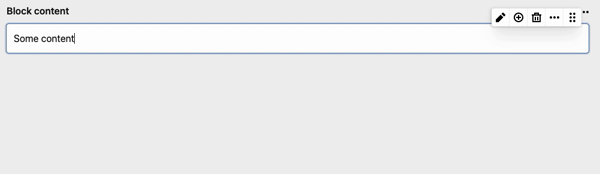

# Kirby Column-Block

## Overview

Use columns in [block fields](https://getkirby.com/docs/reference/panel/fields/blocks) based on the [layout field](https://getkirby.com/docs/reference/panel/fields/layout)! 🤗

Features:

- Use it as WYSIWYG
- Use paste (cmd+v) to insert any blocks in your column
- Use Drag'n'Drop to move contents from outside or inside a column block
- Customize **fieldsets** or **layouts** inside your blueprint in no time



## Installation

**Manually**

[Download](https://github.com/plain-solutions-gmbh/kirby-column-blocks) and copy the plugin into your plugin folder: `/site/plugins/`

**With Composer**

`composer require plain/kirby-column-blocks`

## Simple use

```yml
fields:
  myblock:
    type: blocks
    fieldsets:
      - heading
      - text
      - columns
```

For the output see the [block documentation](https://getkirby.com/docs/reference/panel/fields/blocks#blocks-in-your-templates)

## Customization

**Customize column block for a single block field**

Just extend the column block like this:

```yml
fields:
  myblock:
    label: Block content
    type: blocks
    fieldsets:
      - heading
      - text
      columns:
        extends: blocks/columns
        fields:
          layout:
            layouts:
              - "1/1"
              - "1/2, 1/2"
              - "1/4, 1/4, 1/4, 1/4"
            fieldsets:
              - heading
              - text
```

**Customize column block globally**

Copy `columns.yml` from `site/plugins/column-block/blueprints/blocks/`to `site/blueprints/blocks/` and edit it.

**Customize the output**

Copy `columns.php` from `site/plugins/column-block/snippets/blocks` to `site/snippets/blocks` and edit it.


Need help? See [this post](https://forum.getkirby.com/t/column-block-plugin/26828) from the Kirby forum.

## License

This plugin is free to use and is published under the MIT license. If you use this plugin for commercial purposes or wish to show your appreciation, [support me with a donation](https://www.paypal.com/donate/?hosted_button_id=ZMV4BV3X7EUT4).